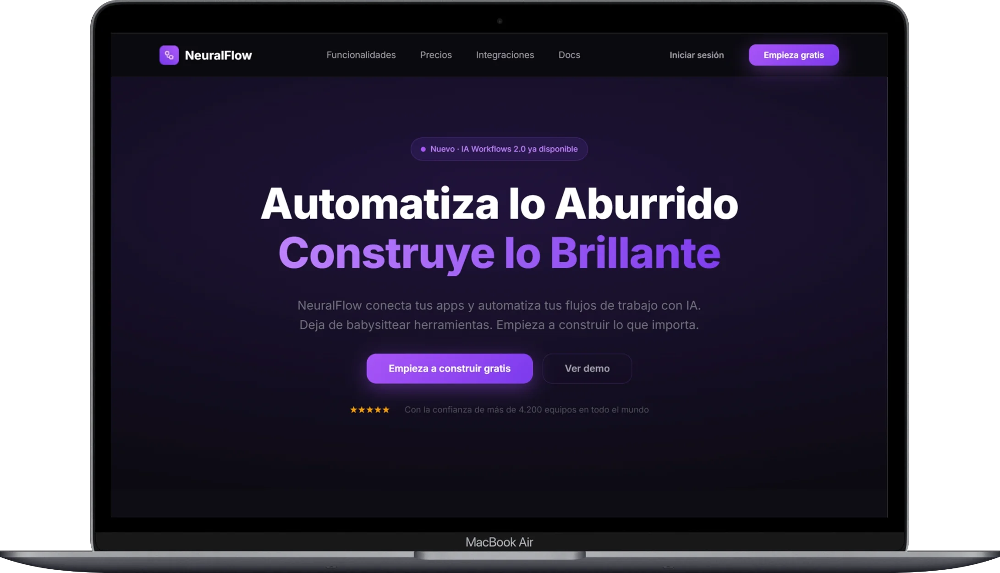
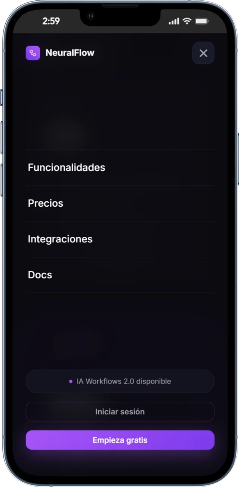
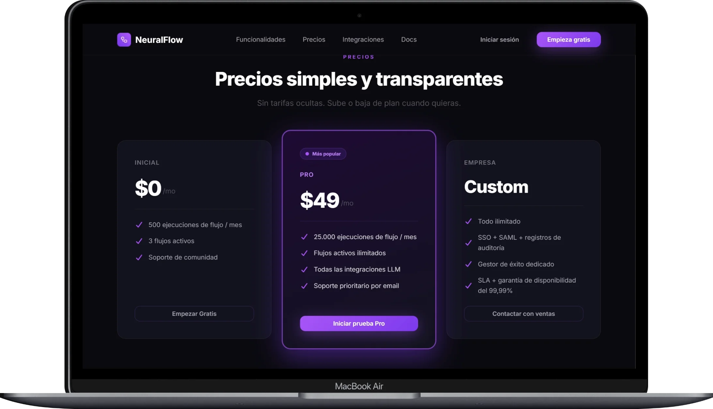
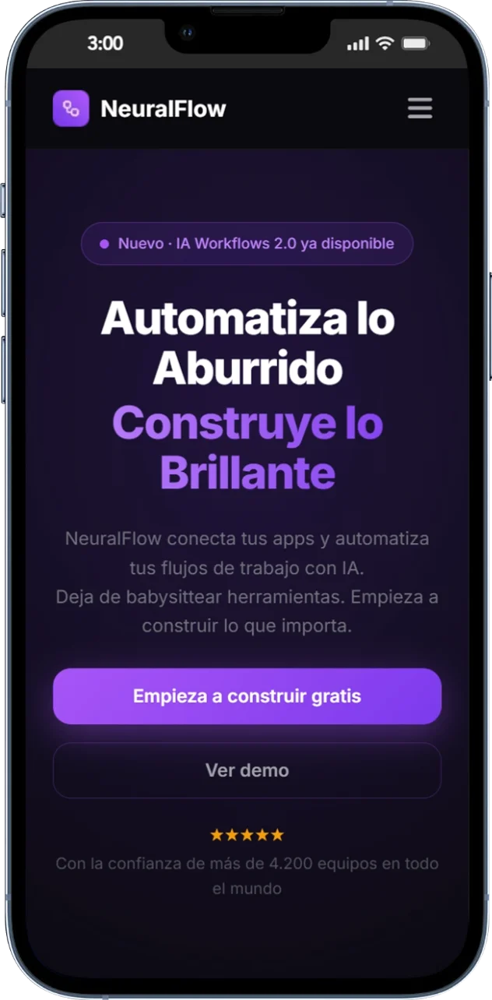
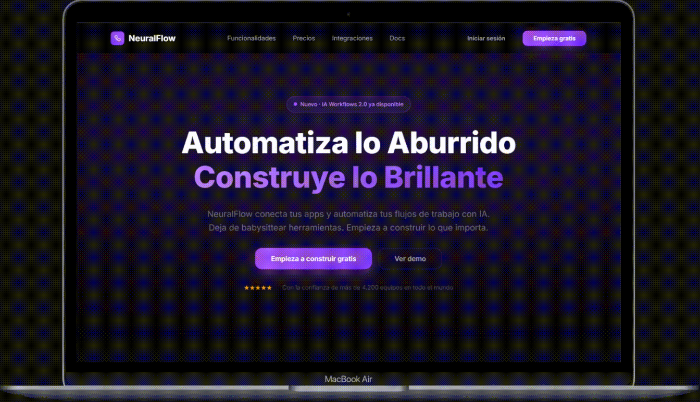

# Landing Page NeuralFlow



Landing page moderna y responsiva para **NeuralFlow**, una plataforma SaaS de automatización de flujos de trabajo con IA. Diseño dark mode premium con glassmorphism, gradientes vibrantes y tipografía limpia. Construida con HTML, CSS y JavaScript puro — sin frameworks, sin dependencias.

---

## 📸 Resultado final

<table>
  <tr>
    <td></td>
    <td></td>
  </tr>
  <tr>
    <td></td>
    <td></td>
  </tr>
</table>

---

<br/>



---

## ✨ Características principales

- **Estructura semántica correcta con HTML5** — uso de `<header>`, `<nav>`, `<main>`, `<section>`, `<footer>` y atributos `aria-*` donde corresponde.
- **Menú hamburguesa responsive** — toggle con JavaScript mínimo, transición y overlay controlados por clases CSS.
- **Sistema de tokens con CSS Custom Properties** — colores, tipografía, espaciado y sombras centralizados en `:root` dentro de `global.css`.
- **Tipografía fluida con `clamp()`** — los tamaños de fuente se adaptan al viewport sin breakpoints extra.
- **Layout con CSS Grid y Flexbox** — bento grid de funcionalidades, tabla de precios y footer construidos sin librerías de layout.
- **Diseño 100% responsive** — mobile-first con media queries nativas, adaptado a móvil, tablet y escritorio.
- **Glassmorphism con `backdrop-filter`** — tarjetas y header con efecto cristal usando solo CSS.
- **Gradientes de texto** — headline del hero con `background-clip: text` y `linear-gradient`.

---

## 🛠️ Tecnologías y estándares

| Capa         | Tecnología                                                            |
| ------------ | --------------------------------------------------------------------- |
| Estructura   | HTML5 semántico                                                       |
| Estilos      | CSS3 — Custom Properties, Grid, Flexbox, `clamp()`, `backdrop-filter` |
| Lógica       | JavaScript ES6+ (Vanilla)                                             |
| Fuentes      | Inter — Google Fonts                                                  |
| Iconos       | Font Awesome 7                                                        |
| Estándar CSS | CSS Nesting nativo (sin preprocesador)                                |

---

## 📂 Estructura del proyecto

```
NeuralFlow/
├── index.html        
├── global.css       
├── styles.css       
├── data.md          
└── img/
    └── logoNeuralFlow.webp
```

---

## 🚀 Cómo usar

1. Descarga o clona el repositorio.
2. Abre `index.html` directamente en el navegador.
3. No necesitas instalar nada.

---

## 📄 Licencia

MIT License – siéntete libre de usar, modificar y subir tu propia versión.
Solo te pido que en el footer o en algún comentario menciones el video original si lo usas como base 😊

---

Hecho con ❤️ por **Roberto AQ**
📺 Suscríbete para más tutoriales → [youtube.com/@programacionparaelmundo](https://www.youtube.com/@programacionparaelmundo)
🐙 GitHub: [github.com/roberto-aq](https://github.com/roberto-aq)

¡Gracias por ver el tutorial!
